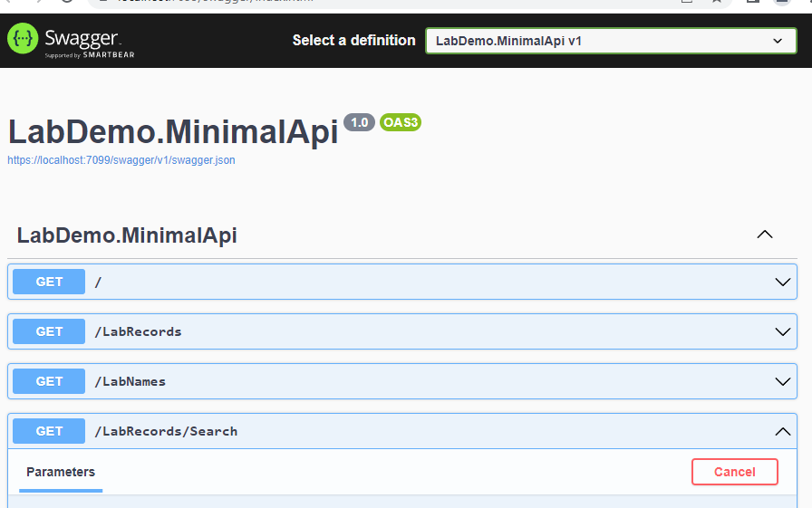
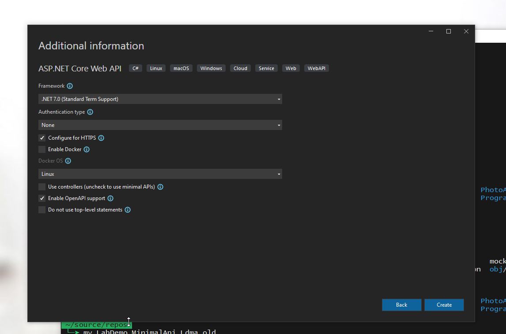
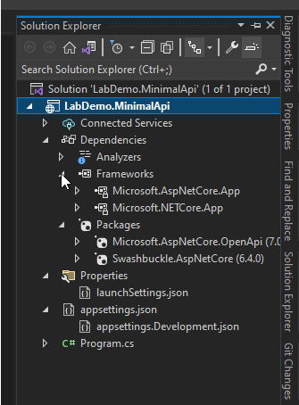

# Overview
## Purpose

As part of a larger system, this subsystem is a minimal API responsible for reporting data. For demonstrative purposes, the data is mocked from medical bloodwork and comes in through the app configuration via a json file.

The API is a minimal API approach -- no controllers, just straight up querying through the minimal API setup to a few different HTTP GETs.

The Github Actions implement a CI approach in stages -- build, test, publish -- using dotnet CLI commands.

## Tech Used

- .NET 7
- OpenApi
- Minimal API
- GitHub Actions
- dotnet cli build steps

## How to Run

Just check out the git repository, open the solution in Visual Studio, and run.  A browser window will appear with Swagger:



## How to Call

1. Ensure the api's url is passed in to the calling app.  For debug, it's easy enough to add to launchSettings:

```"LABWORK_API_URL": "https://localhost:7105"```

1. 1. Follow instructions online to add the OpenApi to the app to call the api
    1. After running the API in Swagger, copy the swagger.json to the calling app
    2. In the Solution Explorer (I'm sure there's a command-line, too), through Connected Services, add the file from #1
2. Then, after NSwag has generated the necessary code from the OpenApi/Swagger json, add code similar to the following:

```
var app = builder.Build();
.
:
var apiUrl = builder.Configuration["LABWORK_API_URL"];
var httpClient = new HttpClient();
var client = new LabClient(apiUrl, httpClient);
var labwork = await client.LabRecordsAsync();
```

# Upcoming Features/Issues

TBD - The deployment to Azure is not working yet.

# The System

Eventually, the overall system will consist of
1. This API, providing information from database (instead of the current mocked data from json configuration file)
    1. Will include stand-alone repo, ci-cd, testing up to the level of the api as a whole, and a docker container running the API
    1. This will include ci-cd all the way through deployment
1. A front-end UI interactively charting the data from the API, probably in Razor
    1. Will include stand-along repo, ci-cd, testing up to the level of the subystem (maybe using Playwright?), and a docker container running the UI
    1. This will include ci-cd all the way through deployment
1. An integration project solution that will orchestrate the api and UI in docker containers, with the ability to run ecosystem tests

- Each subsystem's project solution will have the ability to be run locally with or without its docker container, from the IDE or the command-line
- The integration project solution will be blocked from production

I chose to separate the api from the ui, instead of the usual minimal API approach of putting everything into the web front-end app -- sse *Separation of Concerns*


## Details

### The Start
This API started off with the basic scaffolding/templates via dotnet/Visual Studio:

*Basic Template for ASP.NET Core Web Api without Docker Support (Yet)*



*Minimal Dependencies But with OpenApi*



### OpenAPI

The swagger.json is currently manually copied to the UI project when the API changest. 

There are [ways](https://techcommunity.microsoft.com/t5/healthcare-and-life-sciences/auto-regenerating-api-client-for-your-open-api-project/ba-p/3302390) to automate this.

### Design

<mark>The design covers not only the actual apps -- the ui and api -- **BUT ALSO** the structure of the **repo**sitory, the **building**, the **testing**, the **publishing**, the **monitoring**.</mark>

See "The System" above.

## TESTING

Currently, only "integration" tests exist for the API, and no tests exist for the bare-bones UI.  

Some possible goals for testing

1. Setup project-level and solution-level stages to run locally, debug and production
1. Add Playwright or something similar to automate UI testing
1. Integration tests that spin up the app and ui together, driving UI through Playwright or something similar

### CI-CD

 1. Check the build
 2. Test the api
 3. Publish the api
 4. Deploy the api to azure

 #### OPTIMIZATIONS

 Thinking through cache and artifacts, at looking at the sizes of external dependencies and 
 intermediate build products sizes, I decided 
 - Not to pull external dependencies down in one job and cache for further jobs
     - GitHub Actions aren't quite suited for the kind of caching I wanted for NuGet dependencies
     - Caching has issues due to both dotnet and GitHub Actions
         - dotnet implicit restores are hard to override, especially for test
         - GitHub Actions don't allow for expressions in cache keys
         - GitHub Actions also have some wonkiness in using keys
     - No impactful gains in pulling from a cache over pulling from a nuget source, or vice versa, for this project
 - Not to artifact the external dependencies
     - Pull down 700Mb from the nuget source, upload it as a compressed artifact, download the
     artifact in the next job, then the next job, is not that much different than
     downloading the dependencies in each job, direct from nuget
- Not to pass intermediate builds as artifacts to the next job
    - Time for the dotnet command to run with and without artifacts is not a performance hit
    - Artifacts or no artifacts, the outputs will still consume the same of storage

This means there is redundancy in each job as the API is re-built each time with fresh dependency pulls.

#### OTHER NOTES
##### PATHING
-   Note if an app's project name is the same as a solution name, it can be confusing
   GitHub checks out the repo into `/home/runner/work/{GithubProjectName}/{YourRepoName}`

    -   So, this could lead to building a project of the same name in a directory like
       `/home/runner/work/TheLarryApp/TheLarryApp/TheLarryApp`

    - Matching the `/home/runner/work/{GithubProjectName}` supplied by the GitAction checkout
       then the repo name, `/home/runner/work/{GitHubProjectName}/{YourRepoName}` where the sln lives
       then perhaps the project, `/home/runner/work/{GitHubProjectName}/{YourRepoName}/{YourProjectName}`
           containing `csproj`

##### DOTNET AND CI OPTIMIZATION INCOMPATIBILITY

In theory, one could restore nuget dependencies once at the beginning, then use throughout ci steps

In theory, one could store results of the dotnet build in a custom directory and use in successive commands

In reality, the dotnet commands are not built to be used in this manner, and it's very difficult to set up
cache with nuget dependencies, temporary artifacts from the build, successive ci steps using said cache and
artifacts, and CONFIRMING that the setup is working as expected and that successive dotnet commands are not
just rebuilding the whole darn thing again, and managing the caches and artifacts that build up over time.

##### TRACEABILITY

A crude approach where steps dump output is the traceability of the moment. OpenTelemetry looks interesting, but is beyond scope for noe

##### ABOUT CACHING

 Getting caching to work properly for these discrete ci steps turned out to be out of scope.

 1.  The documentation encourages a cache key with package-lock.json, but this scaffolding doesn't have such
       Instead, I did try to use the csproj files instead, but...

 2.  Setting a global environment variable based on expressions does NOT work, so one needs to repeat the cache key
       in every spot it's used.

 3.  Picking the right cache key specific (or non-specific) enough requires some thinking; see the GitHub Actions docs

 If I was dealing with a rather large solution with multiple projects and different subsets of external dependencies, 
 I would definitely revisit the caching of nugets


##### GLOBAL VARIABLE ISSUES

 *** GLOBAL ENVIRONMENT VARIABLES MUST BE VALUE OR VALUE COMBOS ONLY

 Shell parameter expansion is not possible outside of a run step, so global environment variables are really
 just for values for now

     1) For variables to passed from one step to another in the same job, 
       append variables assigned via parameter expansion to the GitHub environment file
       per https://stackoverflow.com/questions/60432844/how-to-perform-string-manipulation-while-declaring-env-vars-in-github-actions
     2) For variables passed to the next job, use job output https://docs.github.com/en/actions/using-jobs/defining-outputs-for-jobs

### DEPLOYMENT

See [DEPLOYMENT.md](./DEPLOYMENT.md)

### MONITORING

Explore Azure possibilities?

### Separation of Concerns

#### No to API+UI in the Same App

Combining api calls, even minimal api calls, with the ui is not a favored approach of mine under most circumstances. If a really simple case, sure, but in most cases the api and the ui are going to have to scale and are going to be live for a length of time long enough to consider maintainability in the design.

If this was the real world, a better choice would be to have the API and UI sitting in different solutions and deployed separately.

